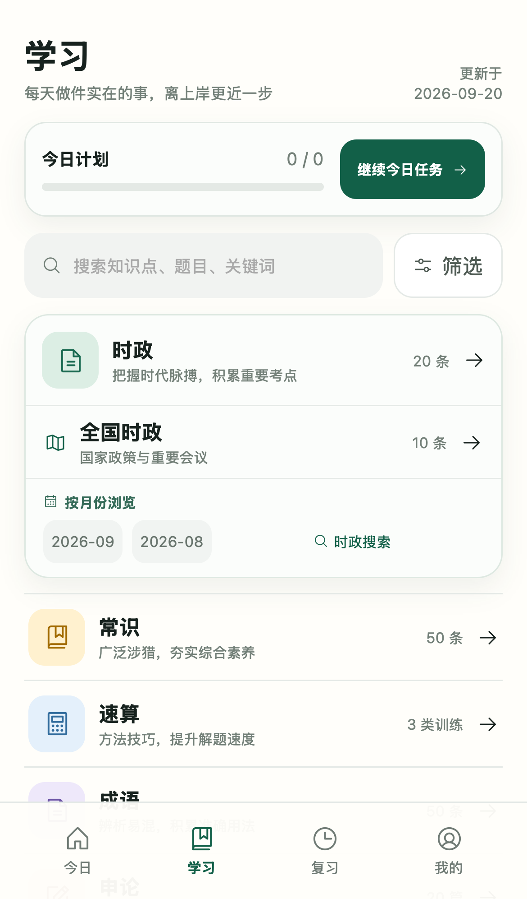

# 公考指南（开源版）

面向公务员考试备考的 Android 学习工具，提供全国时政、常识、成语、申论和速算训练。

本仓库仅包含通用开源版本，不含地方专项内容。

## 界面预览

| 学习首页 | 全国时政 |
| --- | --- |
|  |  |

## 源码

完整源码已打包在 [gongkao-guide-open-source-source.zip](gongkao-guide-open-source-source.zip)。

解压后执行：

```bash
npm install
npm run dev
```

Android 打包需要 JDK 21 与 Android Studio / Android SDK：

```bash
npm run android:apk
```

开源版 Android 包名为 `cn.gongkao.guide.opensource`，可与原版同时安装。

## 开源协议

MIT License。