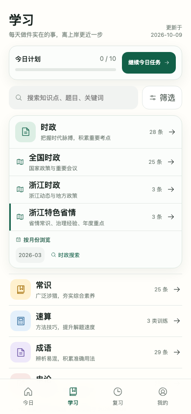
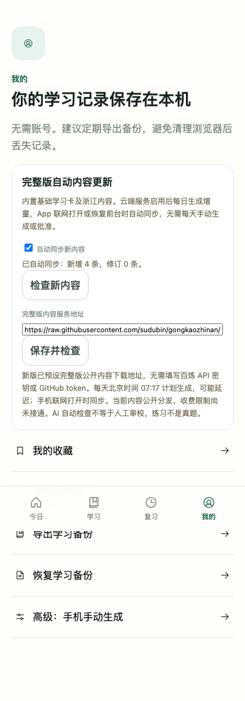

# 公考指南

一个面向公务员考试备考的 Android 学习工具。本仓库保留通用开源版的源码和安装包，同时新增浙江完整版的版本下载；完整版源码暂不在本仓库公开。

## 版本下载

| 版本 | 内容与安装方式 | 下载 |
| --- | --- | --- |
| 浙江完整版 1.2（自动内容更新） | 保留浙江省情、浙江时政；预设完整版内容地址，联网自动合并新内容。每日计划六个方向最多共 30 条。 | [下载新版完整版 APK](https://github.com/sudubin/gongkaozhinan/releases/download/v1.2-full/gongkao-guide-zhejiang-full-1.2.apk) · [版本说明](docs/releases/v1.2-full.md) |
| 浙江完整版 1.1（新增测试版） | 保留浙江省情、浙江时政；内置 106 条学习卡和 81 道原创练习。包名 `cn.gongkao.guide`，与原浙江版本签名相同，可作为原版升级包。 | [下载完整版 APK](https://github.com/sudubin/gongkaozhinan/releases/download/v1.1-full/gongkao-guide-zhejiang-full-1.1.apk) · [版本说明](docs/releases/v1.1-full.md) |
| 通用开源版 1.0（保留） | 全国时政、常识、成语、申论和速算；内置 100 条学习卡和 75 道原创练习。独立包名 `cn.gongkao.guide.opensource`，可与完整版共存。 | [下载开源版 APK](https://github.com/sudubin/gongkaozhinan/releases/download/v1.0-open-source/gongkao-guide-open-source.apk) · [版本说明](docs/releases/v1.0-open-source.md) |

两个安装包均为测试 APK，Android 7.0 及以上可安装；学习记录各自保存在本机，不会因安装另一个版本自动迁移。升级或卸载前建议先导出学习备份。也可从仓库的 [下载文件目录](downloads/) 获取安装包。

**完整版状态：** 每日云端任务、独立公开内容地址和手机增量同步已部署；计划每天北京时间 07:17 更新，以[实际运行记录](https://github.com/sudubin/gongkaozhinan/actions/workflows/full-daily-content.yml)为准，来源不可用或校验失败时保留旧内容、可能少更新。会员和收费尚未接通。安装包没有内置维护者的 API key；公开下载不代表具备付费限制。开源源码、已有内容和历史 APK 保留，开源版旧日更停止，以后只更新完整版内容。

## 浙江完整版界面

| 浙江学习首页 | 完整版更新设置 |
| --- | --- |
|  |  |

## 开源版界面预览

| 学习首页 | 全国时政 |
| --- | --- |
|  |  |


## 开源版基础内容（保留版）

安装包内置 **100 条学习卡**：全国时政、常识、成语、申论各 25 条，另配 75 道原创练习。首次打开即可离线学习，不需要先配置 API。时政初始卡是 2026 年政府工作报告的分主题历史考点，不是 25 个最新独立事件；事件日和来源发布日期分别展示。申论句段是原创写作示范，不是政策原文或名人引语。

开源版已有公共内容库保留在原地址，不再定时新增。完整版使用独立的 `public/content/full/latest.json`，首次迁移保留全部已有 104 条并加入 6 条浙江基础内容，共 110 条，继承当天已用额度。新版 App 联网打开、恢复前台及定时检查时增量同步，保留收藏、笔记、复习和作答；不会静默安装 APK。

完整版沿用仓库加密配置，默认每日六个方向各最多新增 5 条，每方向最多 3 次请求；不会读取或上传手机端密钥。详见[完整版自动更新说明](docs/full-content-automation.md)。生成内容只经过结构、引用和证据片段检查，不等于人工审校；所有 AI 题标记为练习题，不是真题。暂停时将仓库变量 `AUTO_CONTENT_ENABLED` 改为 `false`。

## 已实现

- 今日 / 学习 / 复习 / 我的四导航
- 全国时政、常识、成语、申论、速算入口
- 搜索空状态与主题筛选面板
- 知识卡、来源与适用期、收藏
- 单选题提交、文字化对错反馈、错因与区别笔记
- 成语回忆揭示、易混对照和辨析题
- 申论素材分区及个人摘记
- 基期量公式、精算/估算切换、数字键盘、±2% 边界判分
- 浏览器本地保存学习状态

## 本地运行

```bash
npm install
npm run dev
```

生产构建：

```bash
npm run build
```

## Android 打包

需要 JDK 21 和 Android Studio / Android SDK：

```bash
npm run android:apk
```

构建产物位于 `android/app/build/outputs/apk/debug/app-debug.apk`。开源版 Android 包名为 `cn.gongkao.guide.opensource`，可与原版同时安装。

无需在本机安装打包工具也可使用 [GitHub 云端打包](https://github.com/sudubin/gongkaozhinan/actions/workflows/android-apk.yml)：源码更新后自动构建，也可手动运行。成功后从对应运行记录的 Artifacts 下载 `gongkao-guide-open-source-debug-apk`，解压得到 APK；下载需登录 GitHub，产物保留 90 天。当前为调试安装包，不是正式签名发行版；不同云端构建的签名可能变化，跨构建升级前请备份学习记录。

仓库根目录仍为开源版源码，不是浙江完整版的完整源码。早期上传的开源源码压缩包保留作历史备份，不代表当前版本。GitHub 发布页自动生成的 Source code 压缩包同样是此仓库的开源源码，不含未公开的完整版源码。

## 项目范围

学习记录保存在本机，公共学习内容从本仓库自动同步。API 密钥与个人学习数据不会进入公共内容包。开源仓库包含独立构建所需的内部组件，不依赖原版项目目录；原版项目保留不变。

## 开源协议

本仓库的开源版源码继续采用 [MIT License](LICENSE)，原许可文件保持不变。完整版 APK 内保留其复用部分的 `OPEN-SOURCE-NOTICES.txt`；这次没有上传完整版源码，也没有新增商业授权或收费条款。
