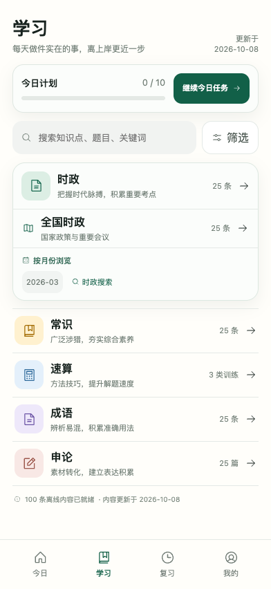
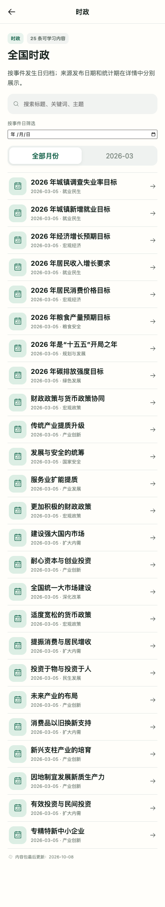
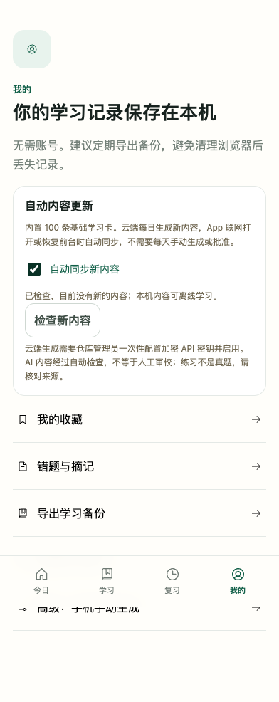

# 公考指南（开源版）

一个面向公务员考试备考的 Android 学习工具，提供全国时政、常识、成语、申论和速算训练。此仓库仅包含通用开源版本，不含地方专项内容。

## 界面预览

| 学习首页 | 全国时政 |
| --- | --- |
|  |  |



## 初始内容与自动更新

安装包内置 **100 条学习卡**：全国时政、常识、成语、申论各 25 条，另配 75 道原创练习。首次打开即可离线学习，不需要先配置 API。时政初始卡是 2026 年政府工作报告的分主题历史考点，不是 25 个最新独立事件；事件日和来源发布日期分别展示。申论句段是原创写作示范，不是政策原文或名人引语。

云端任务可每天自动生成增量内容，默认目标每模块 5 条、合计 20 条；每批立即保存，重复内容跳过，来源不足时不强行凑数。App 在联网打开、恢复前台及前台定时检查时自动合并新内容，保留原库、收藏、笔记、复习和作答记录。手机关闭时由云端生成，不承诺 Android 在后台准点下载。

仓库管理员须一次性设置加密 API 配置并启用任务；当前代码不会自动读取或上传手机端密钥。详见 [自动更新配置](docs/content-automation.md)。生成内容只经过自动结构、引用和证据片段检查，不等于逐条人工审校；所有 AI 题标记为练习题，不是真题。

## 已实现

- 今日 / 学习 / 复习 / 我的四导航
- 全国时政、常识、成语、申论、速算入口
- 搜索空状态与主题筛选面板
- 知识卡、来源与适用期、收藏
- 单选题提交、文字化对错反馈、错因与区别笔记
- 成语回忆揭示、易混对照和辨析题
- 申论素材分区及个人摘记
- 基期量公式、精算/估算切换、数字键盘、±2% 边界判分
- 浏览器本地保存学习状态

## 本地运行

```bash
npm install
npm run dev
```

生产构建：

```bash
npm run build
```

## Android 打包

需要 JDK 21 和 Android Studio / Android SDK：

```bash
npm run android:apk
```

构建产物位于 `android/app/build/outputs/apk/debug/app-debug.apk`。开源版 Android 包名为 `cn.gongkao.guide.opensource`，可与原版同时安装。

无需在本机安装打包工具也可使用 [GitHub 云端打包](https://github.com/sudubin/gongkaozhinan/actions/workflows/android-apk.yml)：源码更新后自动构建，也可手动运行。成功后从对应运行记录的 Artifacts 下载 `gongkao-guide-open-source-debug-apk`，解压得到 APK；下载需登录 GitHub，产物保留 90 天。当前为调试安装包，不是正式签名发行版；不同云端构建的签名可能变化，跨构建升级前请备份学习记录。

仓库根目录为最新完整源码。早期上传的源码压缩包保留作历史备份，不代表当前版本。

## 项目范围

学习记录保存在本机，公共学习内容从本仓库自动同步。API 密钥与个人学习数据不会进入公共内容包。开源仓库包含独立构建所需的内部组件，不依赖原版项目目录；原版项目保留不变。

## 开源协议

本项目采用 [MIT License](LICENSE)。
